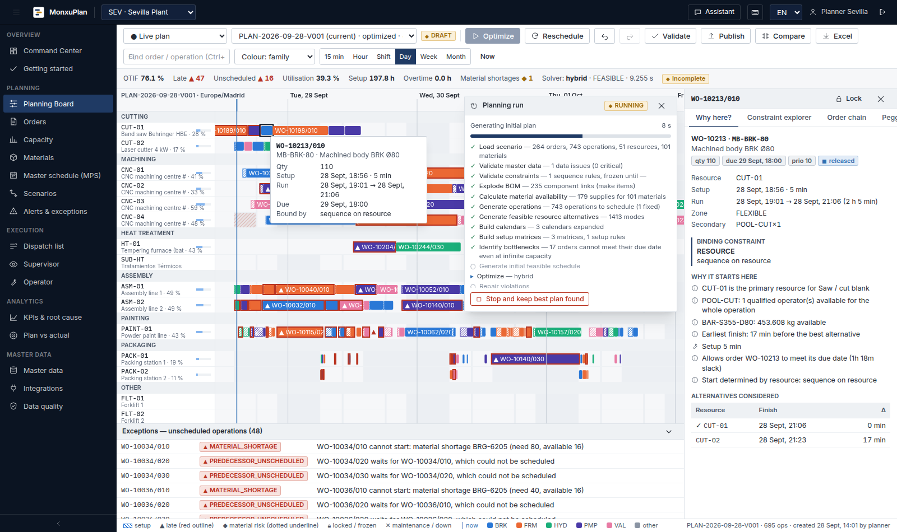

# MonxuPlan

Advanced Planning & Scheduling for discrete manufacturing: finite-capacity scheduling of machines,
people, tools and materials in one feasible plan — explainable, optimised, reproducible, adjustable by
hand and reactive to the shop floor.



## What it does

* **Feasible by construction** — calendars (plant time zone, DST, shifts, breaks, holidays, overtime),
  maintenance and breakdowns, alternative resources with speed factors, labour pools with skills,
  tools, sequence-dependent setups, precedences with overlap/transfer batches, minimum waits, material
  availability with pegging (never consumes stock that does not exist), frozen zone, locks.
  Hard constraints are never mixed with preferences; an independent validator re-checks every plan.
* **Optimised** — weighted or lexicographic objectives (OTIF, tardiness, setup, WIP, inventory,
  makespan, overtime, stability, cost) with presets; heuristic, CP-SAT, hybrid LNS and MIP providers
  behind one interface; Quick / Normal / Deep time budgets; honest status, bound and gap; deterministic
  mode.
* **Explainable** — for every operation: binding constraint, reasons, alternatives, constraint
  explorer, root-cause chain per order, earliest possible date at infinite capacity, bottlenecks
  ranked by measured overload and induced waiting.
* **Interactive** — Gantt with drag & drop and server-side impact preview, six replan modes,
  undo/redo, versioned plans, publish with audit.
* **What-if** — copy-on-write scenarios (night shift, extra machine, rush order, supplier delay,
  breakdown, more operators, overtime) and side-by-side comparison.
* **Connected** — import wizard (Excel/CSV/JSON), exports, REST API with OpenAPI, inbound MES/ERP
  events with optional automatic rescheduling, signed webhooks, Server-Sent Events, API keys, OIDC.
* **Platform** — multi-tenant, multi-plant, RBAC, audit log, data-quality gate, MPS/MRP with rough-cut
  capacity, Monte Carlo robustness and sensitivity, plan vs actual, dispatch/supervisor/operator views,
  grounded planning assistant.

## Quick start (development, no infrastructure)

```bash
# API + planning engine (Python 3.11+)
cd backend
pip install -e ".[dev]"
python -m monxuplan.seed.demo           # demo tenant "Monxu Manufacturing" (Sevilla + Querétaro)
uvicorn monxuplan.api.app:app --port 8000

# Web (Node 22)
cd ../frontend
npm install
npm run dev                              # http://localhost:3000
```

Sign in as `planner` / `Monxu-Demo-2026` (also `manager`, `supervisor`, `operator`, `viewer`,
`admin`). Open the Planning Board and press **Optimize**.

Full stack with PostgreSQL, Redis, separate workers: `cd deploy && cp .env.example .env && docker compose up -d --build`.

## Repository

| Path | Content |
|---|---|
| `backend/monxuplan_engine` | Pure planning engine: `solve(Problem) -> Solution` (no database, no web) |
| `backend/monxuplan` | Platform: data model, migrations, security, services, REST API, worker, demo and acceptance data |
| `frontend` | Next.js application (own component library, canvas Gantt) |
| `deploy` | Docker Compose stack and environment template |
| `docs` | Architecture, engine, optimisation, data model, API, deployment, user guide, testing, design system, screenshots |
| `tests/e2e` | Browser walkthrough |

## Documentation

[Architecture](docs/ARCHITECTURE.md) · [Planning engine](docs/PLANNING_ENGINE.md) ·
[Optimisation](docs/OPTIMIZATION.md) · [Data model](docs/DATA_MODEL.md) · [API](docs/API.md) ·
[Deployment](docs/DEPLOYMENT.md) · [User guide](docs/USER_GUIDE.md) · [Testing](docs/TESTING.md) ·
[Design system](docs/DESIGN_SYSTEM.md)

## Status and limits

Implemented and tested end to end as described above. Not included yet (shown as *Coming soon* where
visible): native ERP/MES connectors (SAP, Oracle, Dynamics, Odoo, Sage, Infor — use the REST API or
file import), GraphQL, operation splitting across resources at run time, imperial display units (metric only), and full French, German and
Portuguese translations (navigation is translated; other text falls back to English).
